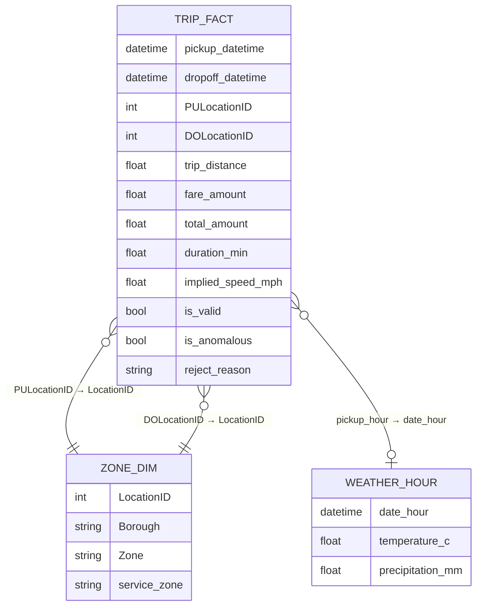
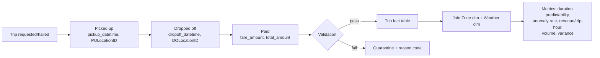

# Workflow / Data Model (Class 7)

## Entities

- **Trip** (fact / event record): the core unit of work. One row per
  observed trip in the source data.
- **Zone** (dimension): `LocationID → Borough, Zone name, service_zone`.
  Used for both pickup and dropoff.
- **WeatherHour** (dimension/context): `date_hour, temperature_c,
  precipitation_mm` for NYC, joined to trips by the pickup hour.

## Events / states represented per trip

A trip in this dataset is observed at exactly these state transitions —
no more, no less (see `source_map.md` for why richer workflow states like
"dispatch requested" or "driver assigned" are NOT modeled: they don't exist
in the source):

```
requested/hailed → picked_up (pickup_datetime, PULocationID)
                  → dropped_off (dropoff_datetime, DOLocationID)
                  → paid (fare_amount, total_amount, payment_type)
```

## Interventions / outcomes (as derived, not source, fields)

- `is_valid` — did the trip pass all validation rules (Class 6)?
- `duration_min`, `implied_speed_mph` — derived operational fields.
- `is_anomalous` — flagged by validation (impossible speed/duration), kept
  and labeled rather than dropped, because the anomaly rate is itself a
  reliability metric.
- `revenue_per_trip_hour` — outcome/efficiency field.

## Relational model (simplified star schema)



## Workflow diagram (event flow)


